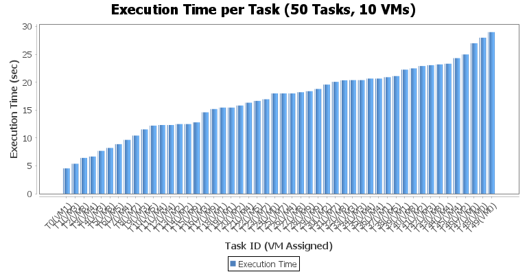
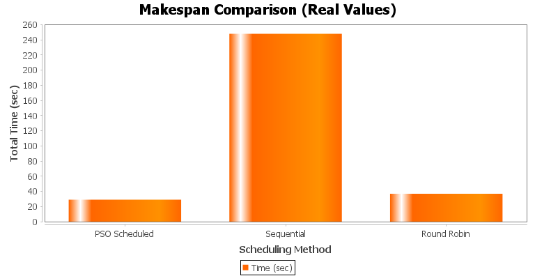
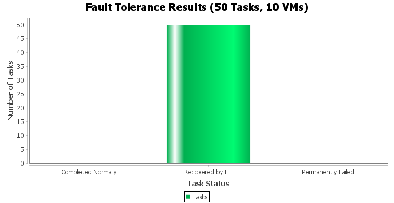
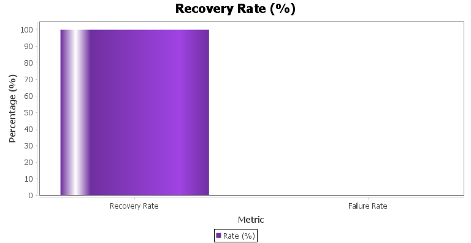

# PSO + Fault Tolerant Task Scheduling in CloudSim

A simulation of PSO-based task scheduling with fault tolerance using CloudSim 7.0.

## Tech Stack
- Java (OpenJDK 21)
- CloudSim 7.0.1
- Eclipse IDE 2026-03
- JFreeChart 1.0.19

## Features
- PSO algorithm for optimal task-to-VM mapping
- Varied VM speeds (900–1500 MIPS) for realistic optimization
- Fault injection with 10% VM failure probability
- Load-aware replication and resubmission based recovery
- Real Round Robin scheduler for honest comparison
- 100% task recovery rate achieved in simulation

## Project Structure

    src/com/cloudpso/
    ├── MainSimulation.java        → Entry point
    ├── PSO_Scheduler.java         → PSO algorithm
    ├── RoundRobin_Scheduler.java  → Round Robin for comparison
    ├── FaultTolerance.java        → Fault injection and recovery
    ├── ResultsChart.java          → JFreeChart graphs
    ├── Task.java                  → Task model
    └── VmWrapper.java             → VM model

## Results

| Scheduler   | Makespan   |
|-------------|------------|
| PSO (ours)  | 25.67 sec  |
| Round Robin | 36.80 sec  |
| Sequential  | 248.0 sec  |

- Tasks: 50 | VMs: 10
- Tasks Completed: 50/50
- Recovery Rate: 100%

## Simulation Graphs

### Execution Time per Task

### Makespan Comparison

### Fault Tolerance Results

### Recovery Rate

## How to Run
1. Install Eclipse IDE and JDK 21
2. Download CloudSim 7.0.1 and JFreeChart 1.0.19
3. Import project into Eclipse
4. Add CloudSim and JFreeChart JARs to build path under Classpath
5. Delete module-info.java if present
6. Run `MainSimulation.java`

## Versions

| Tool        | Version              |
|-------------|----------------------|
| Eclipse IDE | 2026-03 (4.39.0)     |
| Java JDK    | OpenJDK 21.0.10      |
| CloudSim    | 7.0.1                |
| JFreeChart  | 1.0.19               |
